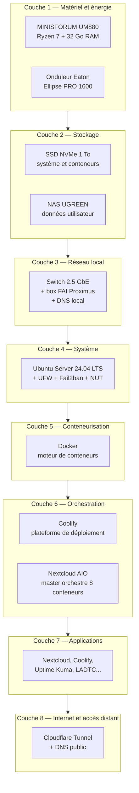
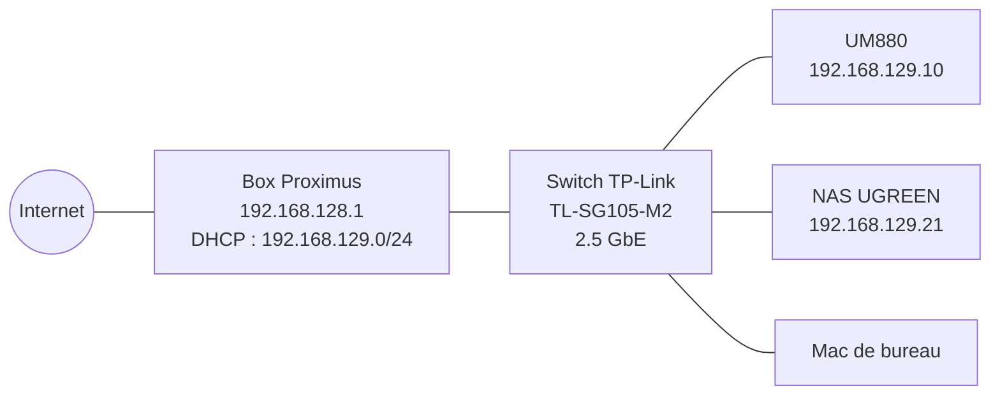
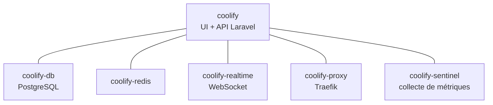
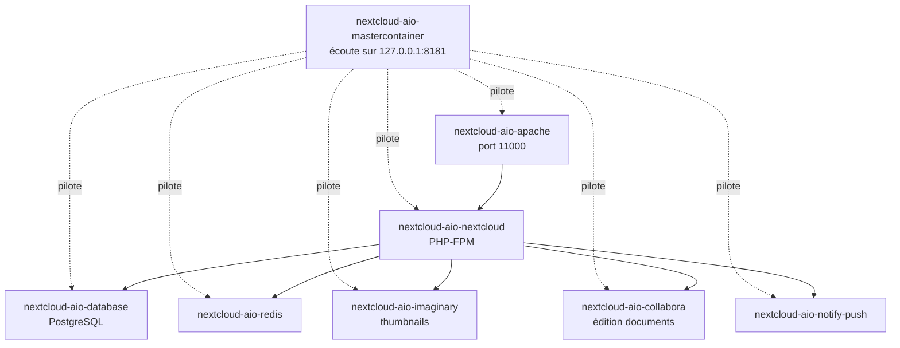
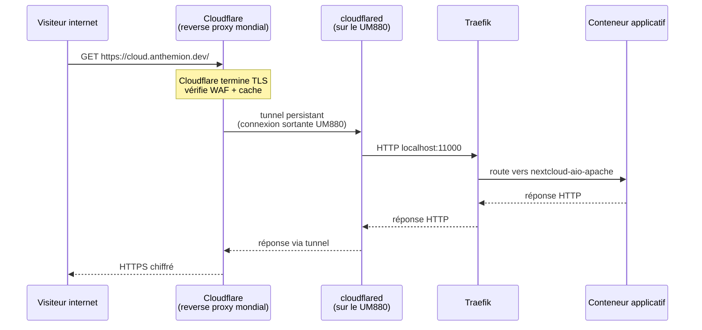
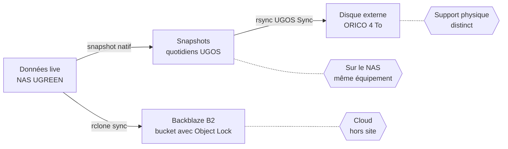
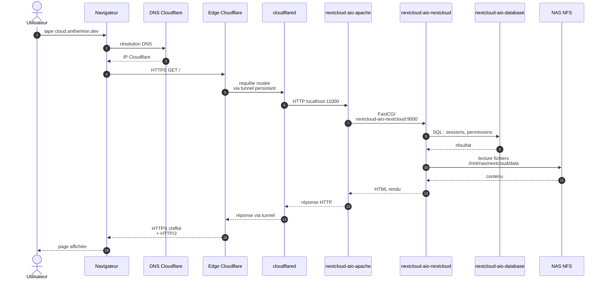

# Comprendre un homelab — guide d'architecture pour débutant

Document pédagogique qui décrit le fonctionnement d'un serveur personnel local, pensé pour servir aussi de matière à un article de blog sur la configuration d'un homelab. Il prend pour exemple l'installation réelle décrite dans [[homelab-manuel]], hébergée chez `anthemion.dev`.

Le document part du matériel et remonte progressivement vers les services en ligne, en expliquant chaque couche avec ses concepts essentiels.

---

## 1. Qu'est-ce qu'un homelab et pourquoi en monter un

Un **homelab** désigne un environnement de serveurs installé chez soi, conçu pour héberger ses propres services en alternative à des prestataires cloud commerciaux. Trois motivations classiques le justifient :

1. **Souveraineté des données** — fichiers, photos, agendas et notes restent sur du matériel physiquement possédé.
2. **Apprentissage** — opérer un système complet bout en bout (réseau, stockage, sauvegarde, exposition Internet) construit une compréhension transférable à beaucoup de métiers IT.
3. **Coût marginal** — une fois le matériel amorti, héberger ses services coûte essentiellement l'électricité consommée.

Un homelab résout les mêmes problèmes qu'un fournisseur de cloud, à une échelle d'un seul utilisateur ou d'un petit foyer. Les mêmes briques techniques s'y retrouvent : un système d'exploitation, des conteneurs applicatifs, un proxy d'entrée, un mécanisme de sauvegarde, une protection électrique.

---

## 2. Vue d'ensemble — la carte d'architecture

L'installation se décompose en huit couches empilées, du plus physique au plus abstrait :



Chaque couche dépend des couches inférieures. La défaillance d'une couche basse interrompt tout ce qui repose dessus. C'est aussi la raison pour laquelle une coupure électrique non gérée casse l'ensemble.

---

## 3. Couche 1 — Le matériel et l'énergie

Trois équipements forment le socle physique.

### 3.1 Le serveur — MINISFORUM UM880 Plus

Mini-PC au format à peine plus grand qu'un livre de poche. Caractéristiques retenues :
- **Processeur** : AMD Ryzen 7 8845HS (8 cœurs / 16 threads, mobile basse consommation)
- **Mémoire** : 32 Go DDR5
- **Stockage interne** : 1 To NVMe (système + cache des conteneurs)
- **Consommation** : 10–35 W selon charge

Le choix d'un mini-PC plutôt que d'un serveur rack répond à trois contraintes : silence, consommation et encombrement. Le coût d'achat (~600 €) reste plus avantageux qu'un serveur d'occasion, à performances équivalentes pour une charge personnelle.

### 3.2 Le stockage massif — NAS UGREEN

Le NAS (*Network Attached Storage*) est une seconde machine, autonome, dédiée au stockage. Elle expose ses disques en réseau via des protocoles standards (NFS pour Linux, SMB pour macOS).

Pourquoi déporter le stockage ?
- **Capacité** : un NAS accueille plusieurs disques (4 × 4 To dans cette installation) là où le mini-PC se limite à un seul SSD NVMe.
- **Survie** : si le mini-PC est remplacé, les données restent intactes côté NAS.
- **Snapshots** : le NAS gère lui-même des copies horodatées du stockage, transparentes pour le serveur principal.

### 3.3 L'onduleur — Eaton Ellipse PRO 1600

Un **onduleur** (ou UPS, *Uninterruptible Power Supply*) est une batterie tampon placée entre la prise murale et les équipements. En cas de coupure secteur, il continue à alimenter le matériel pendant quelques minutes — assez pour déclencher un arrêt propre des services.

Un onduleur ne sert pas seulement à survivre à une coupure : il protège aussi contre les micro-coupures, surtensions et bruits électriques qui dégradent silencieusement le matériel.

Le déclenchement de l'arrêt propre nécessite un dialogue logiciel entre l'onduleur et le serveur. C'est le rôle de NUT, expliqué en couche 4.

---

## 4. Couche 2 — Le stockage

Deux types de stockage cohabitent, avec des rôles distincts.

```mermaid
flowchart LR
    subgraph host[Serveur UM880]
        nvme[SSD NVMe 1 To<br/>OS + binaires Docker<br/>+ volumes éphémères]
    end
    subgraph nas[NAS UGREEN]
        appdata[/mnt/nas/appdata<br/>volumes persistants]
        ncdata[/mnt/nas/nextcloud<br/>données Nextcloud]
        backups[/mnt/nas/backups<br/>dumps applicatifs]
        tm[/mnt/nas/timemachine<br/>sauvegardes macOS]
    end
    host -- NFS v4 --> nas
```

### 4.1 SSD NVMe local

Hébergé dans le mini-PC, il contient :
- Le système Ubuntu lui-même.
- Les images Docker téléchargées (chaque application Docker pèse 100 Mo à 2 Go).
- Les fichiers temporaires des conteneurs.

Sa rapidité (lecture aléatoire > 3 Go/s) sert essentiellement aux opérations Docker et aux bases de données.

### 4.2 NAS NFS

Le NAS est monté sur le serveur exactement comme si c'était un disque interne — via le protocole **NFS** (*Network File System*). Sur la ligne de commande, `/mnt/nas/nextcloud` se manipule comme n'importe quel dossier. La différence est que les données transitent par le câble Ethernet et résident physiquement sur le NAS.

Les données utilisateur (fichiers Nextcloud, photos, documents) vivent toutes sur le NAS. En cas de remplacement du mini-PC, on rebranche le NAS au nouveau serveur, on remonte les partages, et les services repartent sans perte.

---

## 5. Couche 3 — Le réseau local

Le LAN (*Local Area Network*) connecte tous les équipements à l'intérieur de la maison.



### 5.1 Adressage IP

Chaque équipement a une adresse IP, comme un numéro de téléphone interne :
- `192.168.128.1` : la box (passerelle vers Internet)
- `192.168.129.10` : le serveur (statique, défini dans Ubuntu)
- `192.168.129.21` : le NAS (réservé côté DHCP)

Le serveur a une adresse **statique** (toujours la même) parce que beaucoup de configurations en dépendent. Le NAS a une IP fixée par réservation DHCP côté box — fonctionnellement équivalent.

### 5.2 Pare-feu UFW

UFW (*Uncomplicated Firewall*) est un pare-feu logiciel installé sur le serveur. Il filtre les connexions entrantes selon une liste de règles explicites. Tout port non explicitement ouvert est bloqué.

Règles actives sur ce serveur :

| Port | Service | Origine autorisée |
|---|---|---|
| 22/tcp | SSH (administration) | tout réseau |
| 8000/tcp | UI Coolify | tout réseau |
| 11000/tcp | Apache Nextcloud | tout réseau |
| 3493/tcp | NUT (onduleur) | NAS uniquement |

Note : ces ports sont ouverts **côté réseau local**, pas côté Internet. La box Proximus ne forwarde aucun port vers l'extérieur. L'accès depuis Internet passe par Cloudflare Tunnel (couche 8), qui n'a pas besoin de ports entrants.

### 5.3 Fail2ban — défense contre les tentatives répétées

Fail2ban surveille les logs SSH. Si une même adresse IP rate trois tentatives d'authentification, elle est bannie pour quelques minutes via une règle pare-feu automatique. Cela rend les attaques par force brute économiquement non rentables pour un attaquant.

---

## 6. Couche 4 — Le système d'exploitation

Le serveur tourne sous **Ubuntu Server 24.04 LTS** (*Long-Term Support* — support étendu jusqu'à 2029). Distribution Linux mainstream, bien documentée, compatible nativement avec Docker.

### 6.1 Le rôle du système

Le système d'exploitation gère :
- Les processus (qui tourne, avec quels privilèges).
- Les ressources (CPU, mémoire, disque).
- Les périphériques (USB de l'onduleur, carte réseau).
- Les services en arrière-plan (`systemd` les démarre au boot, les surveille, les redémarre si besoin).

### 6.2 Services système actifs (`systemd`)

| Service | Rôle |
|---|---|
| `docker.service` | Démarrage du moteur de conteneurs |
| `ssh.service` | Accès distant |
| `ufw.service` | Pare-feu |
| `fail2ban.service` | Détection des tentatives d'attaque |
| `nut-server.service` | Communication avec l'onduleur |
| `nut-monitor.service` | Décision d'arrêt propre sur batterie faible |
| `cloudflared.service` | Tunnel d'exposition Internet |
| `unattended-upgrades` | Mises à jour de sécurité automatiques |

### 6.3 NUT — le pont onduleur-serveur

NUT (*Network UPS Tools*) lit l'état de l'onduleur via le câble USB et le relaie à tous les équipements qui en ont besoin. Sur cette installation :
- Le serveur joue le rôle de **primary** : il dialogue directement avec l'onduleur.
- Le NAS joue le rôle de **secondary** : il interroge le serveur via le port 3493 pour connaître l'état batterie.

En cas de batterie faible (< 20 %), NUT déclenche `shutdown -h +0` sur les deux machines — arrêt propre, sauvegarde correcte de l'état système avant épuisement complet.

---

## 7. Couche 5 — Docker et la conteneurisation

Docker est le concept le plus important à saisir pour comprendre un homelab moderne.

### 7.1 Ce qu'est un conteneur

Un **conteneur** est un processus isolé qui croit tourner sur son propre système. Il ne voit que les fichiers et les processus de son enveloppe, pas ceux du serveur hôte. Cette isolation tient à des mécanismes du noyau Linux (`namespaces`, `cgroups`), exposés par Docker via une interface unique.

L'analogie courante : un conteneur est à un programme ce qu'un conteneur maritime est à une cargaison. Le contenu (Nextcloud, PostgreSQL, Redis...) se transporte d'un serveur à l'autre dans une boîte standardisée, sans dépendance externe.

Avantages concrets pour un homelab :
- **Reproductibilité** : un même conteneur tourne identiquement sur n'importe quel serveur.
- **Isolation** : un crash d'un conteneur ne touche pas les autres.
- **Mise à jour atomique** : on remplace un conteneur entier par sa nouvelle version, sans toucher au système hôte.
- **Désinstallation propre** : supprimer un conteneur ne laisse aucune trace en dehors de ses volumes de données.

### 7.2 Image, conteneur, volume

Trois termes à distinguer :

| Concept | Définition | Analogie |
|---|---|---|
| **Image** | Modèle figé, en lecture seule | Le moule d'un objet en série |
| **Conteneur** | Instance en exécution d'une image | L'objet sorti du moule |
| **Volume** | Espace disque persistant, attaché à un conteneur | La boîte de rangement où l'objet stocke ses affaires |

Quand on remplace un conteneur par sa nouvelle version (mise à jour), le volume reste — donc les données aussi.

### 7.3 Réseau Docker

Docker crée ses propres sous-réseaux internes pour isoler les conteneurs. Sur cette installation, chaque projet Coolify obtient son propre réseau (`10.0.x.0/24`). Les conteneurs d'un même projet communiquent entre eux par leurs noms (`postgres-db` peut joindre `app-frontend` directement), et seuls les ports explicitement publiés sortent vers le serveur hôte.

---

## 8. Couche 6 — L'orchestration applicative

Au-dessus de Docker se trouvent les outils qui gèrent le cycle de vie des applications : déploiement, mise à jour, surveillance, exposition. Deux orchestrateurs cohabitent ici, avec des philosophies différentes.

### 8.1 Coolify — la plateforme à tout faire

[Coolify](https://coolify.io/) est un *Platform-as-a-Service* auto-hébergé. Il joue le rôle qu'un Vercel ou un Heroku tiendrait dans un environnement cloud commercial : on lui pointe un dépôt Git, on définit quelques variables, et il déploie l'application complète.

Coolify s'occupe de :
- Pull du code depuis GitHub.
- Build de l'image Docker à partir du `Dockerfile` (ou détection automatique de Nixpacks).
- Création d'un réseau Docker pour le projet.
- Démarrage des conteneurs (app + base de données + cache si besoin).
- Configuration du proxy Traefik (couche suivante) pour exposer l'application.
- Renouvellement des certificats TLS Let's Encrypt.

Stack Coolify propre :



### 8.2 Traefik — le proxy d'entrée

Traefik est un reverse proxy : il accueille toutes les requêtes HTTP/HTTPS entrantes, lit le nom de domaine demandé, et route vers le conteneur correspondant.

Concrètement, quand `ladtc.be` est demandé :
1. Traefik reçoit la requête sur son port 443.
2. Il lit l'en-tête `Host: ladtc.be`.
3. Il trouve dans sa table de routage que ce domaine correspond au conteneur `app-kmpuu3pd...`.
4. Il transfère la requête en interne sur le port 3000 du conteneur.
5. Il renvoie la réponse au client, ajoute un certificat TLS valide à la volée.

Traefik génère et renouvelle automatiquement les certificats Let's Encrypt par la méthode ACME — pas d'intervention manuelle après le premier déploiement.

### 8.3 Nextcloud All-in-One — l'orchestrateur dans l'orchestrateur

Nextcloud AIO (*All-in-One*) est livré sous une forme particulière : un **mastercontainer** qui pilote lui-même 7 à 10 conteneurs enfants. Cette structure ne s'intègre pas naturellement à Coolify, qui s'attend à un projet Docker compose classique. AIO est donc déployé en parallèle, hors de Coolify.



Le mastercontainer expose une interface web sur `https://127.0.0.1:8181` (restreinte au localhost pour des raisons de sécurité). Depuis cette interface, on lance la stack, on récupère les sauvegardes, on déclenche les mises à jour.

---

## 9. Couche 7 — Les applications hébergées

Vue d'inventaire des services qui tournent effectivement :

| Application           | Type                                                | URL publique            | Stack technique    |
| --------------------- | --------------------------------------------------- | ----------------------- | ------------------ |
| **Nextcloud**         | Cloud personnel (fichiers, agenda, contacts, notes) | `cloud.anthemion.dev`   | AIO (8 conteneurs) |
| **Coolify**           | UI d'administration                                 | `coolify.anthemion.dev` | Laravel + Traefik  |
| **Uptime Kuma**       | Monitoring des autres services                      | `uptime.anthemion.dev`  | Node.js            |
| **LADTC**             | Application Next.js + Postgres                      | `ladtc.be`              | Géré par Coolify   |
| **Portfolio staging** | Site statique Nginx                                 | usage interne           | Nginx Alpine       |
| **Beszel**            | Monitoring système (CPU, RAM, disque)               | usage interne           | Go                 |

Chaque application est indépendante des autres. La défaillance de Nextcloud n'affecte ni LADTC, ni Coolify.

---

## 10. Couche 8 — L'accès depuis Internet via Cloudflare Tunnel

Exposer un serveur à domicile sur Internet implique normalement d'ouvrir des ports sur la box du fournisseur d'accès. Cette approche pose trois problèmes :
- **Sécurité** : tout le monde sur Internet peut tester les ports ouverts.
- **IP changeante** : la plupart des fournisseurs distribuent des IPv4 dynamiques.
- **CGNAT** : certains fournisseurs partagent une IP publique entre plusieurs abonnés, rendant l'ouverture de ports impossible.

**Cloudflare Tunnel** résout ces trois problèmes par une approche inversée. Au lieu d'attendre des connexions entrantes, le serveur ouvre lui-même une connexion sortante persistante vers Cloudflare. Les requêtes des visiteurs arrivent d'abord chez Cloudflare, qui les pousse dans le tunnel jusqu'au serveur.



Avantages concrets :
- **Aucun port n'est ouvert sur la box** — la surface d'attaque côté domicile est nulle.
- **L'IP du serveur reste masquée** — les visiteurs voient une IP Cloudflare.
- **TLS terminé chez Cloudflare** — les certificats sont gérés par Cloudflare, sans tâche locale.
- **Protection DDoS** — Cloudflare absorbe les attaques en amont.

Le service `cloudflared` tourne en arrière-plan sur le serveur, surveillé par `systemd`. Sa configuration mappe chaque sous-domaine vers une URL interne :

```yaml
ingress:
  - hostname: cloud.anthemion.dev
    service: http://localhost:11000
  - hostname: coolify.anthemion.dev
    service: http://localhost:8000
  - hostname: uptime.anthemion.dev
    service: http://localhost:80
  - service: http_status:404
```

---

## 11. Sauvegarde — la règle du 3-2-1

Le principe : conserver **3 copies** des données, sur **2 supports différents**, dont **1 hors site**. Cette règle survit à la plupart des scénarios catastrophe (panne disque, vol, incendie, ransomware).



### 11.1 Copie 1 — snapshots sur le NAS

Le NAS conserve automatiquement des snapshots quotidiens des volumes. Un fichier supprimé par erreur peut être restauré jusqu'à 30 jours en arrière. C'est la copie la plus rapide à utiliser (récupération en quelques secondes) mais aussi la moins résistante : si le NAS lui-même tombe, ces snapshots disparaissent.

### 11.2 Copie 2 — disque externe ORICO

Un disque dur externe USB de 4 To, branché en permanence au NAS. Un job `rsync` quotidien à 10h copie le contenu des volumes du NAS vers ce disque. C'est une protection contre la panne matérielle du NAS lui-même.

### 11.3 Copie 3 — Backblaze B2 (cloud)

Backblaze B2 est un service de stockage objet à très bas coût (~5 USD/To/mois). Un script bash invoque `rclone` toutes les nuits à 4h pour synchroniser les volumes sensibles :

```bash
#!/bin/bash
LOG=/var/log/rclone-b2-backup.log
rclone sync /mnt/nas/nextcloud b2:homelab-backup-anthemion/nextcloud --log-file=$LOG
rclone sync /mnt/nas/appdata    b2:homelab-backup-anthemion/appdata    --log-file=$LOG
rclone sync /mnt/nas/backups    b2:homelab-backup-anthemion/backups    --log-file=$LOG
```

Le bucket B2 a **Object Lock** activé : aucune copie ne peut être écrasée ou supprimée pendant une période définie. Même un attaquant ayant compromis le serveur ne peut pas effacer les sauvegardes distantes — c'est la protection ultime contre les ransomwares.

---

## 12. Comment une requête traverse tout le système

Pour illustrer comment les couches collaborent, voici le parcours complet d'une requête de visite du cloud personnel.



Une dizaine de composants coopèrent pour servir une seule page. Chacun fait une chose, et la fait bien — c'est l'idée centrale de l'architecture en couches.

---

## 13. Ce que cette installation n'a pas (et pourquoi)

Choisir des limites est aussi structurant que choisir des fonctionnalités. Cette installation **ne contient pas** :

- **Pas de WiFi sur le serveur** — la carte MediaTek MT7902 du UM880 n'a pas de driver Linux stable. Ethernet uniquement.
- **Pas de Kubernetes** — Docker suffit pour un hôte unique. Kubernetes apporte une complexité justifiée seulement à partir de plusieurs serveurs.
- **Pas de SSO unifié** — chaque application gère ses utilisateurs. Sur un homelab single-user, l'overhead d'un Keycloak ou d'un Authelia n'est pas rentable.
- **Pas de monitoring avancé (Prometheus + Grafana)** — Beszel et Uptime Kuma couvrent les besoins courants avec une fraction de la consommation mémoire.
- **Pas de réplication haute disponibilité** — l'application est mono-serveur. L'objectif est la durabilité des données (couvert par les sauvegardes), pas la disponibilité 24/7.

Chacune de ces simplifications est délibérée. Un homelab personnel n'a pas les mêmes exigences qu'un service commercial — l'objectif est d'optimiser le temps d'opération, pas d'imiter une stack d'entreprise.

---

## 14. Coût et consommation

Récapitulatif financier à titre indicatif (prix de référence 2026) :

| Poste | Coût |
|---|---|
| UM880 Plus (32 Go / 1 To) | ~600 € |
| NAS UGREEN + 4 disques 4 To | ~900 € |
| Switch TP-Link 2.5 GbE | 35 € |
| Onduleur Eaton 1600 VA | 230 € |
| Disque externe ORICO 4 To | 110 € |
| **Total matériel** | **~1875 €** |
| Domaine `anthemion.dev` (annuel) | 12 € / an |
| Backblaze B2 (~50 Go) | ~3 € / mois |
| Cloudflare Tunnel | gratuit |
| Électricité estimée (30 W × 24 × 365) | ~80 € / an |

Comparé à un Google Workspace + Dropbox équivalents (~25 €/mois soit 300 €/an) plus les coûts cachés de migration de données, l'amortissement matériel se fait en 5 à 6 ans avec un usage modéré, plus rapidement avec un usage familial.

---

## 15. Pour aller plus loin

Pour reproduire ou adapter cette installation :
- **Procédure détaillée** : [[homelab-manuel]] (référence de configuration courante).
- **Procédure d'installation initiale** : [[homelab-guide-final]] et [[homelab-guide-post-audit]].
- **Maintenance courante** : [[homelab-maintenance]].
- **Récupération après panne** : [[homelab-restart-after-outage]].
- **Incidents et résolutions** : [[homelab-troubleshooting]].

Quelques ressources externes utiles :
- [Documentation Coolify](https://coolify.io/docs)
- [Nextcloud All-in-One](https://github.com/nextcloud/all-in-one)
- [Cloudflare Tunnel](https://developers.cloudflare.com/cloudflare-one/connections/connect-networks/)
- [NUT — Network UPS Tools](https://networkupstools.org/)
- [r/selfhosted](https://reddit.com/r/selfhosted) — communauté homelab active

---

## 16. Notes pour la transposition en article de blog

Quand ce document sera décliné en article public, prévoir les adaptations suivantes :
- **Photos** : prises de vue du caisson antibruit, du UM880, du NAS, de l'onduleur, du câblage.
- **Captures d'écran** : Coolify (dashboard projet), Nextcloud (interface fichiers), Uptime Kuma (statuts services).
- **Schémas exportés en PNG** : les blocs Mermaid sont rendus côté Obsidian, mais une exportation PNG s'intègre mieux à la plupart des moteurs de blog. Outil recommandé : [mermaid.live](https://mermaid.live/) pour générer des PNG vectorisés.
- **Anonymisation** : ne pas publier l'adresse IP du domicile, le numéro de port SSH si modifié, les mots de passe NUT (même s'ils sont locaux), ni le mot de passe AIO.
- **Découpage** : l'article peut se scinder en série de trois ou quatre publications — partie 1 (matériel + OS), partie 2 (Docker + apps), partie 3 (exposition + sauvegardes).
- **Public cible** : débutant motivé qui sait utiliser un terminal mais n'a jamais administré un serveur Linux complet. Une formation `apt install` + `systemctl` + `docker` reste un prérequis qu'il faut référencer en début d'article.
